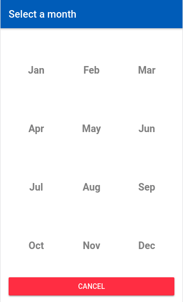

## `@ionicx-components/monthpicker`

Inspired by [ionic-monthpicker](https://github.com/petruisfan/ionic-monthpicker)



### Getting Started

- Install using npm:

```bash
npm install @ionicx-components/monthpicker --save
```

This will install the component that match with latest **Angular** 4+ version. If you wish use Angular 2/4, point to `angular-4.x` branch in the `install` command:

```bash
npm install @ionicx-components/monthpicker@angular-4.x --save
```

### Usage

 - Import the module `IonicMonthPickerModule` to use the component

 ```ts
import { IonicMonthPickerModule } from '@ionicx-components/monthpicker';

@NgModule({
  imports: [
    IonicModule.forRoot(AppComponent)
    IonicMonthPickerModule // Import the module!
  ]
})
export class AppModule {}
 ```

- Use the component into your html template

```html
<ion-monthpicker-trigger 
title="Select a month" lang="en" formControlName="month" cancelLabel="Close" [target]="otherFormControl">
</ion-monthpicker-trigger>
```

### Inputs/Available options

The `IonicMonthPickerModule`contains some all parts show a page/modal with the month calendar:

`IonicMonthPickerTriggerComponent` (Button) => `IonicMonthPickerController` (Service) => `IonicMonthPickerComponent` (Page)

**INPUTS**

| Key  | Type | Default | Why? |
| ---- | ---- | ------ | ---- |
|formControlName | `string` | null | Name of form control, to set the selected month |
|title | `string` | "Select a month" | The text to show in the button and the headerbar of the calendar page|
|text | `string` | null | The button text that will be changed with the selected month |
|lang | `string` | en | The months language. By default, will be displayed months abbreviation in english | 
|monthLabels | `array` | ['Jan', 'Feb', 'Mar', 'Apr', 'May', 'Jun', 'Jul', 'Aug', 'Sep', 'Oct', 'Nov', 'Dec'] | Month labels to display |
|cancelLabel | `string` | "Cancel" | The button cancel of the page/modal calendar |
|container | `object` | {type: string, opts?: any} | The container type to wrap the calendar component (page, modal...) |
|target | `array\|object` | [FormControl, TextInput...] | The target(s) object(s) to fill with the selected month |
|changeBtnTitle | `boolean` | true | Configure to change the button text or not |

> **PS:** You can use all properties of Ionic button component, described in [Ionic Button](https://ionicframework.com/docs/api/components/button/Button/#input-properties) documentation.